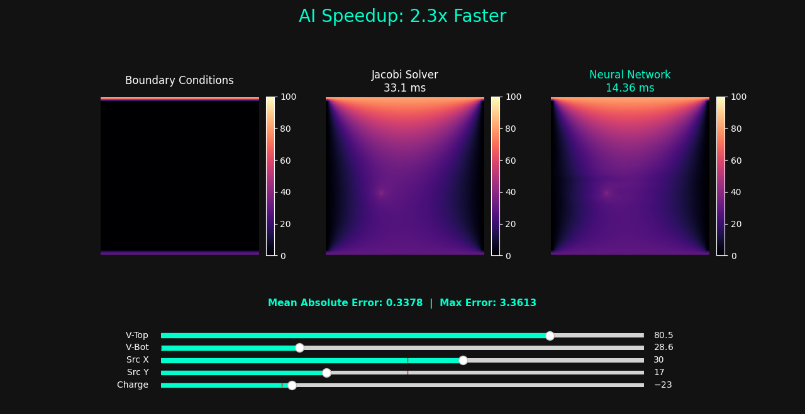

# DeepPoisson: Deep Learning Framework for Poisson Field Estimation

DeepPoisson is an experimental deep learning project that treats electromagnetic field distribution as an image-to-image translation task. By leveraging a **Dilated U-Net architecture**, the model learns to solve the Poisson equation ($\nabla^2 V = f$) in a single forward pass, providing a high-performance alternative to traditional iterative numerical methods.

## ✨ Key Features

* **Neural PDE Solver**: Replaces thousands of iterations of Finite Difference Method (FDM) with a single neural inference pass.
* **High-Speed Inference**: Demonstrates a performance optimization yielding a **1.3x to 2.0x speedup** over traditional CPU-bound iterative numerical solvers.
* **Global Field Awareness**: Uses **Dilated Convolutions** to propagate boundary conditions and point-source effects across the 50x50 grid without losing local detail.
* **Interactive Validation Dashboard**: Features a Matplotlib-based testing environment to manually manipulate charges and voltages, allowing for real-time visual benchmarking of AI predictions against numerical ground truth.
* **Edge Ready**: Includes automated export to **TensorFlow Lite (.tflite)** for optimized performance on low-power or embedded devices.

---

## 🧪 The Method

The project frames physical simulation as a computer vision problem, mapping initial constraints to a steady-state potential field.

### 1. Data Generation (The Physics Engine)
A high-performance C engine generates the training data to ensure physical accuracy.
* **Initial State**: Random Dirichlet boundary conditions (top/bottom voltages) and random point source locations/magnitudes are generated.
* **Numerical Ground Truth**: The engine solves the Poisson equation using the **Jacobi Iteration** method:
  $$V_{new}[i][j] = 0.25 \times (V[i+1][j] + V[i-1][j] + V[i][j+1] + V[i][j-1] - f[i][j])$$
* **Simulation Depth**: Each sample is iterated 2,000 times to ensure the potential field has reached convergence.

### 2. Dilated U-Net Architecture
To solve the "Long Range" problem (where a boundary voltage must affect the center of the grid), the model uses:
* **Encoder**: Sequential convolutions with increasing **Dilation Rates** (1, 2, 4) to expand the receptive field without aggressive downsampling.
* **Bottleneck**: Deep features with a dilation rate of 8 to capture global field trends and long-distance dependencies.
* **Decoder**: Bilinear upsampling combined with **Skip Connections** to recover spatial resolution and ensure boundary sharpness.
* **Final Residual Logic**: The network is trained to learn the "delta" propagation, effectively filling the potential gap between predefined boundaries.

---

## 🏗 Project Architecture

* `dataprep.c`: High-speed C script for generating binary datasets (`x_train.bin`, `y_train.bin`).
* `Poisonus.py`: TensorFlow implementation of the DeepPoisson architecture with a custom learning rate scheduler.
* `RESULTS.py`: Interactive visualization dashboard with sliders for real-time physics testing and validation.
* `poisson_model.tflite`: The optimized, deployment-ready version of the solver.

---

## 🚀 Future Work
* **Variable Boundaries**: Extending the model to support complex, non-rectangular boundary geometries.
* **3D Fields**: Scaling the CNN architecture to 3D voxels for volumetric electrostatic simulations.
* **Physics-Informed Loss**: Integrating a loss term that penalizes solutions violating Gauss's Law ($\nabla^2 V - f \neq 0$).

## 📜 License
This project is licensed under the **MIT License**.